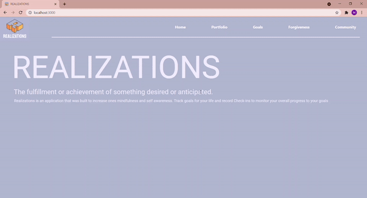

# Realizations

Realizations is a personal development app designed to help users become more mindful not only of themselves but who they want to be.

Each user will have a portfolio where they can record check-ins about where they are in life and a user can record a self gratitude card highlighting something they like about themselves (this can be a personality trait, an act of service, or even how they handled a situation)

users can go to their goals page to track short term and long term plans they have for their life 




## Installations

Copy this in your terminal 
```bash
git clone git@github.com:micaelacolpi/realizations.git
```
on a separate tab in your terminal make sure you cd into api then copy this in your terminal 
```bash
json-server -p 8088 -w database.json
```

Now go back to your first tab and copy this in your terminal 
```bash


npm start 
```
